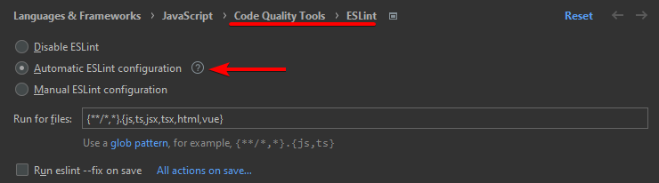
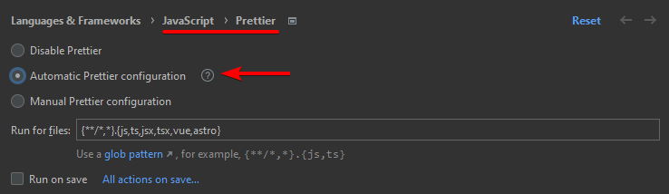
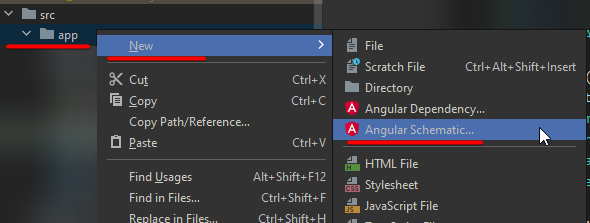

# Setup

## Init project

Follow the [quickstart guide](https://angular.io/quick-start) and then answer the CLI questions.

```bash
cd sandbox
npm init @angular angular-XX
cd angular-XX
npm serve
```

## Lint

Add eslint with `ng lint` (this will recommend the schematic `ng add @angular-eslint/schematics`).

It may complain about the ts version, which may or may not be a problem:  
_"WARNING: You are currently running a version of TypeScript which is not officially supported by @typesc
ript-eslint/typescript-estree."_  
so add a `var x = 1;` to a file, run the linter and see if it catches the problem; it should.

Don't forget to enable eslint in WebStorm:



## Prettier

Install with `npm i -D prettier` and create config with `echo {}> .prettierrc.json`.

.prettierrc.json :question:

```json
{
  "printWidth": 100,
  "singleQuote": true,
  "quoteProps": "preserve"
}
```

.prettierignore :question:

```text
build
coverage
e2e
package-lock.json
```

Don't forget to enable prettier in WebStorm:



## Create a component

Create file (from predefined templates, aka. schematics): `ng generate` / `ng g`
but this must be run in **src/app**, otherwise it will return the following error:  
_"Could not find an NgModule. Use the '--skip-import' option to skip importing in NgModule."_

Create a new component (**g**enerate **c**omponent):

```bash
cd src/app
ng g c pages/AnotherPage
```


